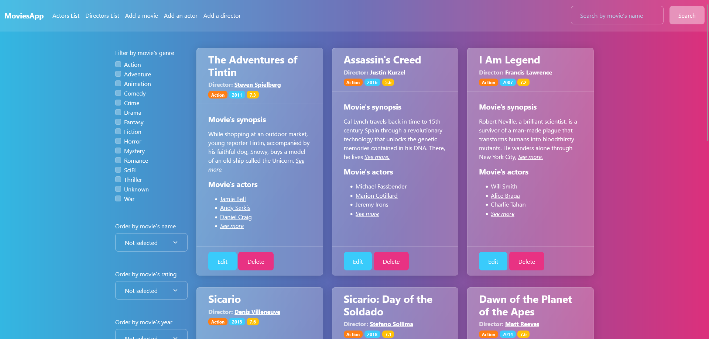

# Movies list web app

_Currently in progress_



# Description
This is a movie library written in .ASP Net Core and EF Core. The whole project has 4 smaller projects:
- MoviesApp.Web
- MoviesApp.Console
- MoviesApp.Data
- MoviesApp.DataSeeder

The projects supports add, edit, remove, search and filter operations. 
For each movie you can add actors and director, set rating, release year, genre and synopsis. 
The web version supports self signed certificate for https and is not recommended for production.

# How to run
To run the project you need to make .env file by using the .env.example file.\
The project needs to have mysql database to run.

db_name= [name of database]\
db_username= [username of database]\
db_password= [password for user of database]\
db_root_password= [root password]\
db_host= [ip of the database server]\
db_seed=true [if true it populate with data, otherwise only creates the database]

If you want to run it with docker you should have docker and docker-compose installed. Then edit the .env file with the right config and set db_host=db. The project uses a self signed certificate.

```
for linux
- open the project folder
- run: sudo docker build -t movieswebapp .
- run: sudo docker-compose up -d
- to stop the project run: sudo docker-compose down
```

If you want to run the project without docker you should have installed .Net Core. 
```
for linux, windows and macos (probably)
- open the sub project
- run: dotnet run
```

